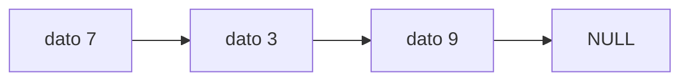

# Informe del avance

*(Borren los comentarios entre paréntesis al escribir.)*

## 1. El escenario

(Descríbanlo en sus propias palabras: qué guarda el programa, quién lo
usa y para qué. No copien el enunciado.)

## 2. Qué guarda la estructura y qué operaciones necesita

| Operación | Qué hace | Precondición |
|---|---|---|
|  |  |  |

## 3. La estructura escogida y por qué

(Por qué esa y no la otra, en términos del orden en que entran y salen
los elementos y de lo que cuesta cada operación. Citen el texto guía:
Thareja capítulo X, o CLRS 4.ª ed. capítulo Y.)

Costos esperados, con $n$ el número de elementos:

| Operación | Tiempo | Espacio |
|---|---|---|
|  | $O(1)$ | $O(1)$ |

El invariante de la estructura, como fórmula:

$$I:\quad 0 \leq n \leq \text{capacidad}$$

Un diagrama del estado de la estructura, en Mermaid:

## 4. Qué piensan medir

(Qué entrada van a variar, entre qué tamaños, y qué esperan ver.)

## 5. Casos de prueba

| Caso | Entrada | Salida esperada | Salida obtenida |
|---|---|---|---|
| funcional 1 |  |  |  |
| funcional 2 |  |  |  |
| funcional 3 |  |  |  |
| límite |  |  |  |

(El caso límite es la estructura vacía, con un solo elemento, llena, o
con la clave repetida: digan cuál escogieron y por qué.)
