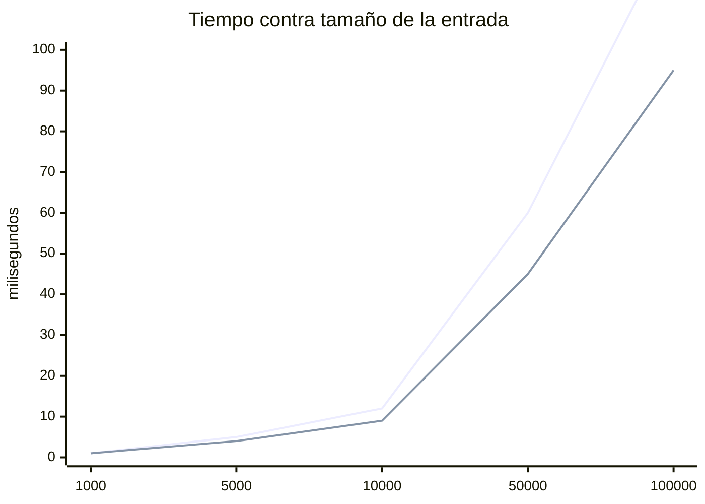

# Informe final

*(Parte del informe del avance, corregido con la realimentación.)*

## 1. El escenario y el modelado

(Del avance, corregido.)

## 2. Las dos estructuras

(Qué operaciones expone cada una y por qué la interfaz es la misma.)

## 3. Análisis formal de complejidad

Una demostración por operación no trivial, en cuatro partes:

**Teorema.** (Enunciado con la cota.)

**Demostración.** Se procede de forma directa. (La estrategia.)

*Desarrollo.* (La cadena de desigualdades, con la justificación de cada
paso.)

$$T(n) = \ldots \leq c \cdot n^2 \quad \text{para todo } n \geq k$$

*Conclusión.* Por lo tanto, $T(n) \in O(n^2)$ con testigos $c = \ldots$
y $k = \ldots$

Resumen de costos:

| Operación | Desde cero | De la biblioteca | Por qué |
|---|---|---|---|
|  |  |  |  |

## 4. Experimentos

Máquina, compilador y banderas con que se midió; cómo se generaron las
entradas; cuántas repeticiones por tamaño.

| $n$ | desde cero (ms) | biblioteca (ms) |
|---|---|---|
| 1000 |  |  |
| 5000 |  |  |
| 10000 |  |  |
| 50000 |  |  |
| 100000 |  |  |

## 5. Lo medido contra lo predicho

(¿Coincide la curva con la cota? Donde no coincida, expliquen por qué:
la constante oculta, la memoria caché, el crecimiento del vector.)

## 6. Conclusiones

(Cuál estructura conviene para este escenario y bajo qué condiciones
cambiaría la respuesta.)
